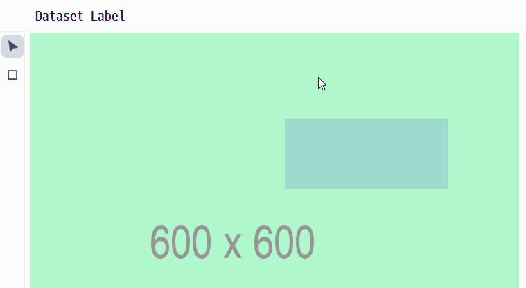

# Labelly - Make Dataset from Your Image!

## WIP: Refactoring
1. State Management
Context API + useReducer --> Redux Toolkit

Context API와 useReducer를 함께 사용하면 전역 상태관리를 할 수 있다.

다만 Redux만큼 커뮤니티의 도움을 받기 어렵다.

예를 들어 Session Storage를 함께 사용할 때 Context API는 모두 다 구현해야 하지만

Redux는 redux-persist 라이브러리를 이용할 수 있다.

2. Folder Structure
Folder by type --> Folder by feature

현재 폴더 구조는 타입 별(reducer 따로 컴포넌트 따로)로 파일들을 묶고 있다.

이런 구조는 처음 개발 속도는 빠르지만 추후 확장이나 유지보수하기가 어렵다.

See also:

[Structure Files as Feature Folders](https://redux.js.org/style-guide/#structure-files-as-feature-folders-with-single-file-logic)

## What You can do
1. Draw a label

2. Choose labels

3. Move a label

4. Delete the selected labels (press backspace or delete key)

## Getting Started with Create React App

This project was bootstrapped with [Create React App](https://github.com/facebook/create-react-app).

## How to start this project
You need [Node.js 16 LTS](https://nodejs.org/en/).

If you installed Node.js, download yarn package manager.
> npm install --global yarn

Clone this repo.
> git clone https://github.com/Ha-limLee/labelly

Change working directory into the cloned directory.
> cd labelly

Install the project dependencies.
> yarn install

Now run CRA dev mode.
> yarn start

You'll see browser pops up.

## Available Scripts

In the project directory, you can run:

### `yarn start`

Runs the app in the development mode.\
Open [http://localhost:3000](http://localhost:3000) to view it in the browser.

The page will reload if you make edits.\
You will also see any lint errors in the console.

### `yarn test`

Launches the test runner in the interactive watch mode.\
See the section about [running tests](https://facebook.github.io/create-react-app/docs/running-tests) for more information.

### `yarn build`

Builds the app for production to the `build` folder.\
It correctly bundles React in production mode and optimizes the build for the best performance.

The build is minified and the filenames include the hashes.\
Your app is ready to be deployed!

See the section about [deployment](https://facebook.github.io/create-react-app/docs/deployment) for more information.
